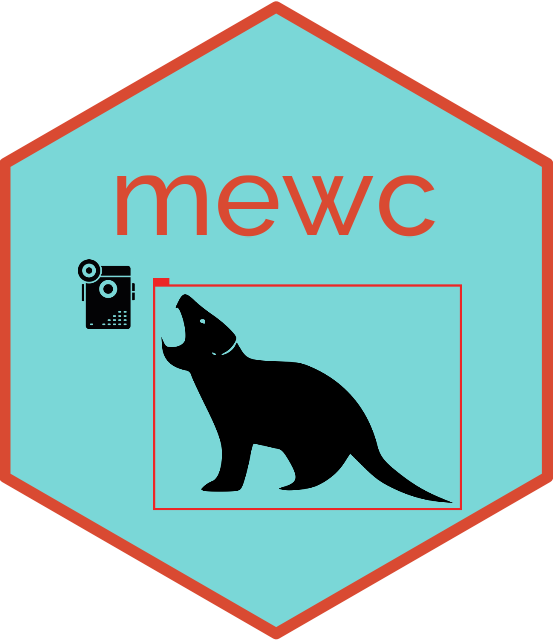

# mewc-flow

This repository contains the Dockerfile and docker-compose.yml files used to build the `mewc-flow` Docker image. The `mewc-flow` Docker image serves as the base image for the `mewc-train` and `mewc-predict` Docker images, which are used for Efficient Net v2 training and prediction for wildlife camera trap images.

- [mewc-train Docker Image Repository](https://github.com/zaandahl/mewc-train)
- [mewc-predict Docker Image Repository](https://github.com/zaandahl/mewc-predict)

The `mewc-flow` image is built on top of the latest stable Python image and includes additional dependencies required by Efficient Net v2 models.

## Version 2 Updates

The `mewc-flow` Docker image has been updated to version 2. Key updates include:

- **Base Image**: Upgraded to `tensorflow/tensorflow:2.16.1-gpu`.
- **CUDA Support**: Added environment variables for CUDA and cuDNN, and installed `JAX` and `JAXLIB` with CUDA 12 support.
- **Updated Dependencies**: The `requirements.txt` file has been updated with the latest versions of key packages, including `jax`, `keras`, `pandas`, and others.
- **Model Support**: Although we default to EfficientNetv2, the ConvNeXt and ViT families are also available. All are sourced via the kimm model zoo API:
https://github.com/james77777778/keras-image-models
  
For users who wish to continue using version 1, the older Dockerfile and requirements can still be accessed by checking out the `v1.0.11` tag:

```bash
git checkout v1.0.11
```

## Efficient Net v2

Efficient Net v2 is a scalable neural network architecture designed for efficiency and accuracy, which is particularly suited to the classification of wildlife images. More information about Efficient Net v2 can be found in its official documentation:

- [Efficient Net v2 Documentation](https://github.com/google/automl/tree/master/efficientnetv2)

## Building the Docker Image

This repository uses `docker-compose` to build the Docker image. To build the `mewc-flow` Docker image, clone this repository and use the `docker-compose` command:

```bash
git clone https://github.com/zaandahl/mewc-flow.git
cd mewc-flow
docker-compose up --build
```

This will create a Docker image named `zaandahl/mewc-flow`.

## Docker Image Contents
The Docker image contains:

- Python environment with the requirements from requirements.txt file installed.
- Necessary utilities (ffmpeg, libsm6, libxext6, nvidia-modprobe, numactl, git, wget, vi) installed.
- Source code copied into the /code directory in the container.
- JAX and JAXLIB installed with CUDA 12 support for enhanced performance.

For detailed information about the image contents, please refer to the Dockerfile in this repository.

## GitHub Actions and DockerHub
This project uses GitHub Actions to automate the build process and push the Docker image to DockerHub. You can find the image at:

- [zaandahl/mewc-flow DockerHub Repository](https://hub.docker.com/repository/docker/zaandahl/mewc-flow)

For users needing the older version, the v1.0.11 image is also available on DockerHub by using the appropriate tag:

```bash
docker pull zaandahl/mewc-flow:v1.0.11
```

## Shared configuration contract

`lib_common` parses declared options by their configured type. Boolean parsing
runs before integer parsing and accepts True/False, true/false, 1/0, yes/no,
and on/off; invalid boolean or integer values fail explicitly. Strings stay
strings. Callers supplying an explicit override mapping also get unknown-key
validation; unrelated process environment variables are ignored. YAML mappings
reject duplicate keys instead of silently overwriting labels or settings.

Architecture-to-image-size lookup matches the complete option. ENB0/EN0 map to
224, ENB2/EN2 to 260, ENS to 384, ENM/ENL to 480, ENXL/ENX to 512,
CNP/CNN to 288, other supported CN variants to 384, and VTT/VTS/VTB/VTL
(including ViTT/ViTS/ViTB/ViTL aliases) to 384. Unknown options fail; they no
longer fall back to 384. Shape agreement alone does not validate a serialized
model's architecture or class order; `mewc-predict` handles model preflight.
Accelerator imports occur only when training requests `setup_strategy`, so
configuration tests can run without TensorFlow or JAX.

Run the focused tests with `PYTHONPATH=src python -m pytest -q test` in an
environment containing pytest and PyYAML.
